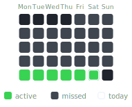

<div align="center">

# System Design Notes

##### Deep system design understanding through Excalidraw-first concept notes and visual design walkthroughs.

[](https://github.com/mauli-waghmore/system-design-notes/actions/workflows/ci.yml)
[](#-concept-index)
[](#-design-problem-index)
[](https://excalidraw.com)
[](LICENSE)

[**Progress**](#-progress) &nbsp;·&nbsp; [**Concepts**](#-concept-index) &nbsp;·&nbsp; [**Problems**](#-design-problem-index) &nbsp;·&nbsp; [**Workflow**](#-workflow) &nbsp;·&nbsp; [**Structure**](#-project-structure)

</div>

---

## Progress

<!-- STATS:START -->
<div align="center">

**1** concepts &nbsp;·&nbsp; **0** designs &nbsp;·&nbsp; **1** diagrams &nbsp;·&nbsp; **0** complete &nbsp;·&nbsp; **0**-day streak &nbsp;·&nbsp; **0** longest &nbsp;·&nbsp; **0** / 30 active

**Daily activity** &nbsp;·&nbsp; 2026-05-24 -> 2026-06-22



</div>

<table width="100%">
  <thead>
    <tr>
      <th>Lane</th>
      <th align="right">Draft</th>
      <th align="right">Review</th>
      <th align="right">Complete</th>
      <th align="right">Total</th>
    </tr>
  </thead>
  <tbody>
    <tr>
      <td>Concepts</td>
      <td align="right">1</td>
      <td align="right">0</td>
      <td align="right">0</td>
      <td align="right">1</td>
    </tr>
    <tr>
      <td>Design problems</td>
      <td align="right">0</td>
      <td align="right">0</td>
      <td align="right">0</td>
      <td align="right">0</td>
    </tr>
  </tbody>
</table>


<!-- STATS:END -->

<div align="center"><sub>Everything above is generated from <code>concepts/</code> and <code>problems/</code> on every push - never edited by hand.</sub></div>

```mermaid
%%{init: {"xyChart": {"plotColorPalette": ["#0969da", "#3DA639"]}}}%%
xychart-beta
    title "Progress by lane"
    x-axis ["Concepts", "Problems"]
    y-axis "Items" 0 --> 2
    bar [1, 0]
    bar [0, 0]
```

## Concept index

<!-- CONCEPTS:START -->
<table width="100%">
  <thead>
    <tr>
      <th align="center">#</th>
      <th>Concept</th>
      <th align="center">Status</th>
      <th align="center">Added</th>
    </tr>
  </thead>
  <tbody>
    <tr>
      <td align="center">01</td>
      <td><a href="https://excalidraw.com/#url=https%3A%2F%2Fraw.githubusercontent.com%2Fmauli-waghmore%2Fsystem-design-notes%2Fmaster%2Fconcepts%2Fwhat-is-system-design.excalidraw">What Is System Design?</a></td>
      <td align="center"><code>Draft</code></td>
      <td align="center">-</td>
    </tr>
  </tbody>
</table>
<!-- CONCEPTS:END -->

## Design problem index

<!-- PROBLEMS:START -->
_No design problems yet - add folders under_ `problems/`.
<!-- PROBLEMS:END -->

## Learning model

This repo has two lanes:

<table width="100%">
  <thead>
    <tr>
      <th>Lane</th>
      <th>Purpose</th>
      <th>Format</th>
    </tr>
  </thead>
  <tbody>
    <tr>
      <td>Concepts</td>
      <td>Build deep understanding of individual building blocks like caching, load balancing, indexing, queues, consistency, partitioning, and rate limiting.</td>
      <td>One focused Excalidraw file per concept with explanation and drawing in the same canvas.</td>
    </tr>
    <tr>
      <td>Problems</td>
      <td>Practice end-to-end system design using requirements, APIs, data model, architecture, scaling strategy, trade-offs, and failure handling.</td>
      <td>One folder per design problem with <code>README.md</code> and <code>diagram.excalidraw</code>.</td>
    </tr>
  </tbody>
</table>

Concepts and problem designs are visual-first. The explanation should live inside the Excalidraw canvas so the notes, flow, and drawing can be reviewed together.

## Content standard

Use [templates/concept-template.excalidraw](templates/concept-template.excalidraw) for every concept canvas so the structure stays consistent.

Each concept should answer:

- What problem does this solve?
- How does it work internally?
- Where is it used in real systems?
- What are the trade-offs?
- What can fail?
- How does it scale?
- What interview follow-ups usually appear?

Each design problem should cover:

- Functional and non-functional requirements
- Capacity estimates where useful
- APIs and core entities
- High-level architecture
- Data model and storage choices
- Scaling strategy
- Failure modes and recovery
- Trade-offs and alternatives
- Final Excalidraw diagram with explanation inside the canvas

## Workflow

```bash
python3 scripts/generate_readme.py          # rebuild progress, indexes, and activity SVG
python3 scripts/generate_readme.py --check  # verify generated files are current
```

When adding new content:

1. Pick one concept or one design problem.
2. Write the smallest complete version first.
3. Add diagrams or examples only when they improve understanding.
4. Run `python3 scripts/generate_readme.py`.
5. Revisit older notes as understanding improves.

## Naming

Use lowercase, hyphen-separated names:

```text
concepts/load-balancing.excalidraw
concepts/database-indexing.excalidraw
problems/design-url-shortener/
problems/design-whatsapp/
```

## Project structure

<details>
<summary><b>Repository layout</b></summary>

<br>

```text
system-design-notes/
├── README.md
├── concepts/
│   ├── load-balancing.excalidraw
│   ├── caching.excalidraw
│   ├── database-indexing.excalidraw
│   └── message-queues.excalidraw
├── problems/
│   ├── design-url-shortener/
│   │   ├── README.md
│   │   └── diagram.excalidraw
│   ├── design-whatsapp/
│   │   ├── README.md
│   │   └── diagram.excalidraw
│   └── design-instagram-feed/
│       ├── README.md
│       └── diagram.excalidraw
├── scripts/generate_readme.py
├── templates/concept-template.excalidraw
├── assets/activity.svg
└── .github/workflows/
```

</details>

## Status legend

<table width="100%">
  <thead>
    <tr>
      <th>Status</th>
      <th>Meaning</th>
    </tr>
  </thead>
  <tbody>
    <tr>
      <td><code>Draft</code></td>
      <td>First complete pass exists</td>
    </tr>
    <tr>
      <td><code>Review</code></td>
      <td>Needs cleanup, examples, or diagram review</td>
    </tr>
    <tr>
      <td><code>Complete</code></td>
      <td>Clear, consistent, and ready to revisit later</td>
    </tr>
  </tbody>
</table>

## License

MIT - see [LICENSE](LICENSE).

---

<div align="center">
<sub>Built as a long-term system design notebook: steady progress, clear diagrams, and no shallow shortcuts.</sub>
</div>
